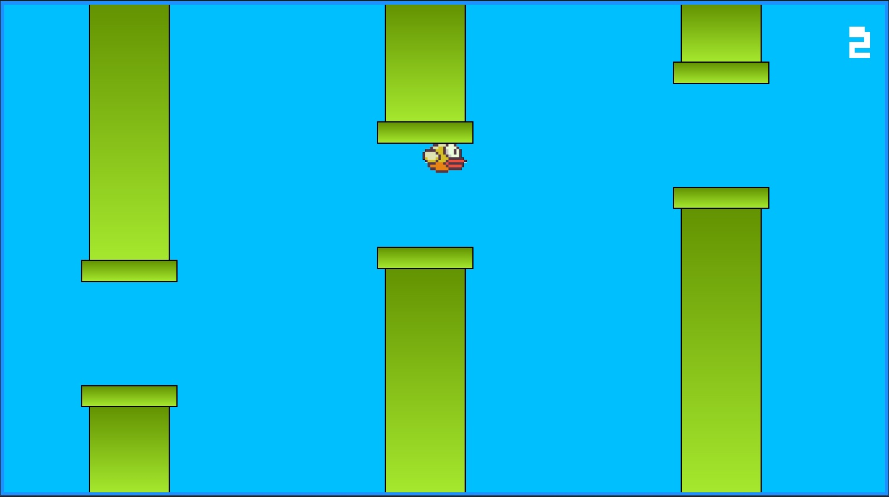

<h1 align="center"> Flappy Bird </h1>

Projeto do jogo Flappy Bird  

  <a href="#-tecnologias">Tecnologias</a>&nbsp;&nbsp;&nbsp;|&nbsp;&nbsp;&nbsp;
  <a href="#-projeto">Projeto</a>&nbsp;&nbsp;&nbsp;|&nbsp;&nbsp;&nbsp;

 

  

## 🚀 Tecnologias

Esse projeto foi desenvolvido com as seguintes tecnologias:

- HTML e CSS
- JavaScript
- Git e Github

## 💻 Projeto

O projeto é destinado à divulgação do Filme Super Mario Bros.

- [Visite o projeto online](https://brunanasser.github.io/flappy-bird)